# Cairn MVP Data Model

Scope: sign up, create a case, collect information about the user and the deceased, and generate a personalized four-week journey of first steps (death certificates, banks, funeral arrangements, and related tasks). No document upload at MVP.

This is a cloud-agnostic conceptual model. It is a reduced version of the full conceptual model in this folder.

Last revised 2026-09-22 to merge DECEASED and DEATH_EVENT into a single table (see Design notes) after 2026-09-21 changes that adopted the content-as-code approach for journey templates (see the decision log below) and added `attorney_referral_note`.

```mermaid
erDiagram
    USER ||--o{ CASE_MEMBER : "holds"
    CASE ||--o{ CASE_MEMBER : "has"
    CASE ||--|| DECEASED : "is about"
    CASE ||--o{ CASE_TASK : "journey"
    CONTENT_FILE ||--o{ TASK_TEMPLATE : "loaded at deploy as"
    TASK_TEMPLATE ||--o{ CASE_TASK : "instantiated as"
    TASK_TEMPLATE ||--o{ TEMPLATE_CITATION : "supported by"
    USER ||--o{ CONSENT : "grants"
    USER ||--o{ AUDIT_EVENT : "performs"
    CASE ||--o{ AUDIT_EVENT : "recorded against"
    CASE ||--o{ CONTEXT_ITEM : "described by"

    USER {
        uuid id PK "relational"
        string idp_subject UK "link to identity provider"
        string email
        string first_name
        string last_name
        string phone "optional"
        string sign_in_method "google, apple, email (via Auth0)"
        timestamp created_at
    }

    CASE {
        uuid id PK "relational, security boundary"
        string status "active, paused, closed"
        date journey_started_on
        timestamp tasks_paused_until "supports stepping back from tasks"
        uuid created_by FK
        timestamp created_at
        timestamp purge_after
    }

    CASE_MEMBER {
        uuid case_id PK, FK "relational"
        uuid user_id PK, FK
        string relationship "spouse, child, sibling, other family, POA, fiduciary"
        string role "owner only at MVP"
        string status "active, revoked"
        timestamp created_at
    }

    DECEASED {
        uuid id PK "relational"
        uuid case_id FK, UK
        string legal_first_name
        string legal_middle_name
        string legal_last_name
        date date_of_birth
        string ssn_last4 "full SSN not collected at MVP"
        string domicile_state "drives probate content"
        string veteran_status "yes, no, unknown"
        string has_will "yes, no, unknown"
        date date_of_death "null until the death-event step (UC-6)"
        string place_type "hospital, hospice, home, facility, other"
        string facility_name
        string city
        string county
        string death_state "drives vital records office, required for the journey to generate"
    }

    CONTENT_FILE {
        string path PK "content repository, authoritative source"
        string task_key
        int version
        string content_hash
        string git_release "tag or commit"
    }

    TASK_TEMPLATE {
        uuid id PK "relational, read-only, immutable per version"
        string task_key UK "unique with version"
        int version UK
        string title
        string plain_summary
        int journey_week "1 to 4"
        int sort_order
        int due_offset_days "from journey start"
        string jurisdiction "US or state code"
        json applies_when "JSONB rules on veteran, will, state"
        boolean attorney_referral
        string attorney_referral_note "required when attorney_referral is true"
        timestamp counsel_reviewed_at
        string content_hash
        string git_release
        boolean active
        timestamp loaded_at
    }

    TEMPLATE_CITATION {
        uuid id PK "relational, read-only, loaded with template"
        uuid template_id FK
        string authority_name "issuing authority"
        string url
        string jurisdiction
        date last_verified_on
    }

    CASE_TASK {
        uuid id PK "relational"
        uuid case_id FK
        uuid template_id FK "pinned to an immutable template version"
        string status "not_started, in_progress, done, skipped, not_applicable"
        date due_on
        timestamp snoozed_until
        timestamp completed_at
        timestamp updated_at
    }

    CONSENT {
        uuid id PK "relational"
        uuid user_id FK
        string purpose "terms, privacy, ai_processing"
        string policy_version
        timestamp granted_at
        timestamp withdrawn_at
    }

    AUDIT_EVENT {
        uuid id PK "relational, append-only"
        uuid actor_id FK
        uuid case_id FK
        string action
        string object_type
        uuid object_id
        timestamp occurred_at
    }

    CONTEXT_ITEM {
        uuid case_id PK, FK "document store, no direct identifiers"
        string item_key PK "CERT_ORDER, FUNERAL, BANK_NOTICES, CONVO_SUMMARY"
        json payload
        timestamp updated_at
        timestamp expires_at
    }
```



## Accounts, onboarding, and the trial (migration 0008)

From `cairn-registration-use-cases.json`. Mapped onto existing tables rather than new ones.

- **USERS** gains `preferred_name`, `name_pronunciation`, `name_prefill` (provider-shared, pre-fill only), `voice` (steady_direct, warm_patient, brisk_businesslike, plain_practical, from `voices/manifest.yaml`. Migration 0009 replaced the earlier `personality`), `time_zone`, `onboarding_step`, `status` (pending_onboarding, active_no_case, trial_active, read_only, subscribed, pending_deletion), `trial_started_at`, and `trial_ends_at`. Legal names become optional and are no longer collected at sign-up. Age is not collected (the spec's UC-REG-06 was dropped by product decision).
- **CONSENTS** is the spec's consent record: purposes `privacy_terms`, `trial_terms`, and `ai_notice`, plus `auth_provider` and `client`. Append-only.
- **TRIAL_REMINDERS** holds the day-21 and day-27 reminders, created when the trial starts.
- **IDENTITY_DELETION_REQUESTS** queues Auth0 deletion and Apple token revocation after an account is deleted. It holds the IdP subject only and is emptied as the work is done.
- The trial lasts exactly 672 hours. Migration 0010 moved its start from the first case to the first Start journey (see below). After it ends, case data can be read and deleted but not created or changed, unless the account is subscribed. Drafts stay editable.

## Case creation (migration 0010)

From `cairn-case-creation-use-cases.json` spec 0.3.0. `case-creation-gap-audit.md` has the full mapping.

- **CASES** gains `status` draft (the default), `journey_template_key`, `journey_template_version`, `journey_started_at`, `last_intake_step`, `last_activity_at`, `death_not_yet_occurred`, `skip_explainers`, `name_fallback`, `attorney_triggers`, and `shown_notices`. A draft has no journey and no start date. An active case reads as read_only when the account is read-only.
- **CASE_INTAKE_ANSWERS** is new: one row per data_fields key (user_role, display_name, date_of_death, place_of_death, residence_state, circumstance, veteran_status, estate_plan_status, completed_items) with `answer_state` answered, skipped, or unsure, a JSON value whose shape the database checks, and optional `own_words` for the review screen. No free text for circumstance.
- **JOURNEY_TEMPLATES** is new: the journey selection rules as immutable versions, loaded from `content/journeys/`.
- **CASE_TASKS** gains `selected` and the statuses `check_on_this` and `not_today`. `not_started` is the spec's todo.
- **DECEASED** legal names are nullable. They are collected inside the task that needs them, never on a draft.
- **APP_SETTINGS** is new: `draft_retention_days` and `trial_reminder_days_before`.
- A draft idle for `draft_retention_days` is deleted with its answers and context by `purge_inactive_drafts()`. Active cases are never touched.

## Decision log

| # | Decision | Status |
|---|---|---|
| 1 | Journey data stays in the relational database. `applies_when` rules are stored as JSON in a JSONB column, which gives flexible rules without a second database. | Adopted for MVP |
| 2 | Journey templates and citations are authored as versioned files in a repository (content-as-code). A deploy job loads them into read-only `TASK_TEMPLATE` and `TEMPLATE_CITATION` tables. | Adopted for MVP |
| 3 | A derived, read-optimized journey snapshot in the document store for AI context assembly. | Deferred, see triggers below |

### How items 1 and 2 fit together

The repository is the authoritative source for wording, rules, and citations, so every change gets a pull request and a review trail. The database tables are a read-only copy loaded at deploy. Each template version becomes an immutable row, and `CASE_TASK` points at that exact row. This keeps foreign keys, JSONB rules, and cross-case queries, and it preserves a permanent record of what each family was shown.

Database rows for templates are never edited by hand. A correction means a new file version, a new release, and a new row.

### Item 3: deferred

Add a `JOURNEY_SNAPSHOT` item to `CONTEXT_ITEM` (current week and next few tasks, projected from `CASE_TASK`) only if one of these becomes true:
- AI context assembly becomes a measurable share of latency or cost.
- Task reads dominate overall load.
- Templates diverge into very different structures by state.

The relational tables stay the source of truth if this is added. The snapshot is a disposable copy.

## How the journey works

1. Authors edit template files in the content repository. A pull request runs validation (see rules below).
2. Counsel review is recorded in `counsel_reviewed_at` before a release is tagged.
3. The deploy job loads the tagged release, inserting new immutable `TASK_TEMPLATE` and `TEMPLATE_CITATION` rows for any changed file.
4. On case creation, the system reads the deceased's `death_state`, `domicile_state`, `veteran_status`, and `has_will`, matches `applies_when` and `jurisdiction`, and creates one `CASE_TASK` per match with a `due_on` date.
5. The AI reads `CASE_TASK` status and `CONTEXT_ITEM` details to answer "where are we" and to choose the next single action.

### Release gate rules (validated in CI)

- Every template file must validate against a JSON Schema ([json-schema.org](https://json-schema.org/)).
- Every template must have at least one citation with an authority name, URL, and `last_verified_on`.
- Any template with a jurisdiction other than `US` must name a state code.
- Any template marked `attorney_referral` must include `attorney_referral_note` with the referral wording.
- `due_offset_days` must fall within the template's `journey_week` (week 1 is days 0 to 7, week 2 is days 7 to 14, and so on).
- A release cannot be tagged while any changed template has an empty `counsel_reviewed_at`.
- `task_key` plus `version` must be unique, and a changed file must bump `version`.

### Example template file (illustrative draft, not reviewed)

```json
{
  "task_key": "notify_social_security",
  "version": 1,
  "title": "Let Social Security know",
  "plain_summary": "Ask the funeral home whether they will report the death for you, then confirm it was done.",
  "journey_week": 2,
  "sort_order": 10,
  "due_offset_days": 10,
  "jurisdiction": "US",
  "applies_when": { "always": true },
  "attorney_referral": false,
  "counsel_reviewed_at": null,
  "citations": [
    {
      "authority_name": "Social Security Administration",
      "url": "https://www.ssa.gov/benefits/survivors/",
      "jurisdiction": "US",
      "last_verified_on": null
    }
  ]
}
```

Suggested layout: `content/tasks/us/` for federal tasks and `content/tasks/<state code>/` for state-specific tasks.

### Finding affected families after a correction

When counsel corrects a template, a query over the immutable versions finds every case still working from the old wording:

```sql
SELECT ct.case_id, ct.id
FROM case_task ct
JOIN task_template t ON t.id = ct.template_id
WHERE t.task_key = 'notify_social_security'
  AND t.version < 2
  AND ct.status IN ('not_started', 'in_progress')
```

## Illustrative tasks by week (to reconcile with the journey map)

| Week | Example task keys |
|---|---|
| 1 | confirm_pronouncement, secure_home_and_pets, choose_funeral_provider, order_death_certificates |
| 2 | notify_social_security, notify_employer_and_pension, notify_banks |
| 3 | notify_life_insurers, notify_va_if_veteran, notify_credit_bureaus |
| 4 | forward_mail, cancel_subscriptions, locate_will_and_attorney, plan_next_steps |

## What lives in CONTEXT_ITEM payloads

| item_key | Example payload fields |
|---|---|
| CERT_ORDER | copies_requested, ordered_on, issuing_office, expected_by |
| FUNERAL | provider_name, venue, service_date, service_time, booking_status |
| BANK_NOTICES | list of institution names with notified date and status |
| CONVO_SUMMARY | redacted running summary for continuity |

## Deferred from the full model

- `VETERAN_INFO` and `ESTATE_INFO` become full tables later. At MVP they are single flag columns on `DECEASED`.
- `DOCUMENT` and `VAULT_OBJECT` are removed. No file uploads at MVP, which shrinks the security surface.
- Multi-member sharing is deferred. `CASE_MEMBER` is kept so invites need no schema change later.
- Full SSN and VA file number storage are deferred.
- `JOURNEY_SNAPSHOT` in the document store (decision 3).

## Design notes

- `tasks_paused_until` lets the product step back from task mode without storing any inference about the user's emotional state.
- Do not persist distress classifications at MVP. Health and mental health details are sensitive under the project's privacy policy draft.
- `TEMPLATE_CITATION` and `counsel_reviewed_at` enforce the rule that jurisdiction-specific guidance needs a citation to the issuing authority and legal review.
- **DECEASED and DEATH_EVENT are one table.** The two entities were originally split, but the relationship is one-to-one and the death-event fields (`date_of_death`, `place_type`, `facility_name`, `city`, `county`, `death_state`) are always read together with the identity fields. Merging them removes a join from every query and, most usefully, lets the database enforce `date_of_death >= date_of_birth` directly with a single check constraint. The two-step UX from UC-5 (identity) and UC-6 (death event) is unchanged. It is now an `INSERT` followed by an `UPDATE` on the same row rather than an insert into a second table. `death_state` stays required before the journey can generate jurisdiction-matched tasks, even though the column itself is nullable to support the two-step entry.

## Sources

- PostgreSQL, JSON types (JSONB): https://www.postgresql.org/docs/current/datatype-json.html
- JSON Schema: https://json-schema.org/
- CDC NCHS, Where to Write for Vital Records (death_state determines the issuing office): https://www.cdc.gov/nchs/w2w/index.htm
- SSA, survivors benefits and reporting a death: https://www.ssa.gov/benefits/survivors/
- FTC, Funeral Rule (consumer price list rights): https://www.ftc.gov/legal-library/browse/rules/funeral-rule
- NIST SP 800-53 Rev. 5 (audit and access control families): https://csrc.nist.gov/pubs/sp/800/53/r5/upd1/final
