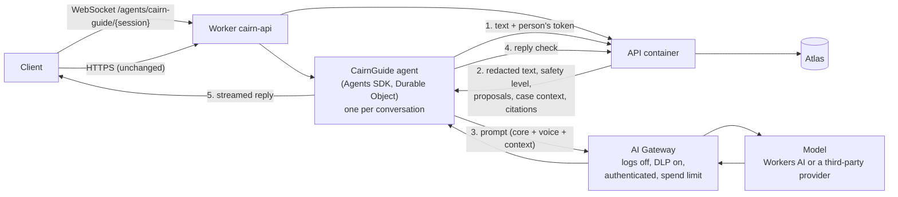
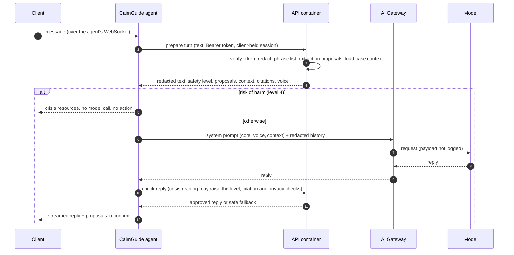

# AI agents on Cloudflare

**Status: [NOT BUILT].** No model is called anywhere in Cairn today. This page records what exists, the rules any model integration must follow, and a proposed design on Cloudflare's [Agents SDK](https://developers.cloudflare.com/agents/) and [AI Gateway](https://developers.cloudflare.com/ai-gateway/). Treat the design as a proposal to review, not a description of running code.

- [What exists today](#what-exists-today)
- [Where models plug in](#where-models-plug-in)
- [Rules any model integration must follow](#rules-any-model-integration-must-follow)
- [Proposed design](#proposed-design)
- [Setting it up, once built](#setting-it-up-once-built)
- [Decisions needed](#decisions-needed)

## What exists today

| Piece | Where | What it does now |
|---|---|---|
| Free-text reading | `api/cairn_api/extraction.py` | Rule-based. Picks the spec's `data_fields` out of what someone typed (UC-CASE-01) and proposes them for confirmation. "A rule-based stand-in until a model does this" |
| Crisis detection | `api/cairn_api/safety.py` | Rule-based phrase list, levels 1 to 4. The crisis plan has two layers, the reviewed phrase list and a model reading. Only the phrase list exists. Needs clinical sign-off (DEC-26-06) |
| Account chat | `api/cairn_api/account_chat.py` | Rule-based. Recognizes "delete my account", "download my data", and notification changes |
| Redaction | `api/cairn_api/redaction.py`, `schemas.RedactedText` | Removes SSNs, card and account numbers from free text while the request is parsed, so "handlers, the database, logs, and any model call only ever see the redacted string" |
| Voices | `voices/core.md`, the four voice files, `manifest.yaml`, `api/cairn_api/voices.py` | The system prompt: shared core rules (comfort-first, one question at a time, citations only from the app, attorney referrals, the distress protocol), then the person's chosen voice |
| Prompt assembly sketch | `voices/assemble_prompt.py` | Orders the prompt for caching (core, then voice, then per-turn context) and calls Anthropic's Messages API directly. A sketch, not used by the API |
| AI notice | `api/cairn_api/content/registration-copy.json` (`ai_notice`), `POST /v1/onboarding/acknowledgments/ai_notice` | People must accept that Cairn is an AI guide before using it (California SB 243 disclosure). Stored in `consents` |
| AI reminder | `CAIRN_AI_REMINDER_EVERY_HOURS` (1 to 3, default 3) | Re-shows the "AI guide" notice during long sessions (UC-CASE-23) |
| Provider name | `CAIRN_AI_PROVIDER_NAME` | The provider named on the privacy step. Today `Example AI Provider` **[LEGAL REVIEW REQUIRED]** |
| Conversation summary | `context_items` key `CONVO_SUMMARY` | A slot for a structured summary. Nothing writes it yet |

## Where models plug in

| Job | Replaces or extends | Model output is |
|---|---|---|
| **Conversation replies** in the person's voice | Fixed copy from the `content/` files | Text shown to the person, after server checks |
| **Reading free text** into `data_fields` | `extraction.extract` | Proposals only. The person confirms each one ("Did I get that right?") before anything is saved |
| **Crisis reading**, the second detection layer | Adds to `safety.classify` | A level. It may raise the phrase list's level, never lower it |
| **Account requests** in plain words | `account_chat` | An intent. The action still goes through the existing routes and their confirmations |

## Rules any model integration must follow

These come from the security invariants in [database/CLAUDE.md](../../database/CLAUDE.md#security-invariants-do-not-weaken) and the specs. They're not optional.

1. **Redact before the model.** Only `RedactedText` reaches a model. The raw text never leaves the API.
2. **Store nothing about distress, and no free text.** The safety level, matched words, and the conversation stay in the client-held session (decision 7). A model call must not create a new place where transcripts or emotional state persist: not a database, not agent state, not gateway logs.
3. **The phrase list runs first and wins.** At risk of harm (level 4), the reply is the crisis resources (988, the Veterans Crisis Line when relevant, 911), and no account action happens in that turn.
4. **The data layer stays the only way to data.** A model or agent never connects to MongoDB. It gets case context from the API, and changes go through API routes as the signed-in person.
5. **Proposals, not actions.** A model proposes field values, task updates, or account actions. The person confirms. The API's validation applies as for a button press.
6. **Facts only from the app.** Procedures, deadlines, fees, and forms come only from `<case_context>` and `<citations>` supplied from reviewed templates (`voices/core.md`).
7. **Minimum context.** Send the model only what the turn needs: the voice, the safety mode, the relevant tasks and their citations, and the redacted text. Never the deceased's full record by default.
8. **Disclose the provider.** `CAIRN_AI_PROVIDER_NAME`, the privacy policy, and the AI notice must name whoever processes the text **[LEGAL REVIEW REQUIRED]**.

## Proposed design

Run the agent on Cloudflare next to the existing Worker, route every model call through AI Gateway, and keep the Python API as the authority for identity, redaction, safety, and data.

### The pieces

| Piece | What it is | Notes |
|---|---|---|
| `CairnGuide` agent | A class extending the Agents SDK's `Agent` (or `AIChatAgent` for chat) in `cloudflare/src/`, bound as a Durable Object | One instance per conversation, named by an unguessable session id. Streams replies over WebSocket |
| Worker routing | `routeAgentRequest` in the Worker's `fetch`, ahead of the container forward | The existing API routes don't change |
| `ai` binding | `"ai": { "binding": "AI" }` in `wrangler.jsonc` | Shared by Workers AI and AI Gateway |
| AI Gateway | One gateway per environment | Routing, rate and spend limits, metrics, DLP. Holds the third-party provider key if one is used |
| API endpoints for the agent | New routes, for example "prepare a turn" and "check a reply" | Do redaction, the phrase list, extraction, and context assembly in Python, where those rules already live and are tested |

### One turn

### Privacy settings that make this safe

| Setting | Why |
|---|---|
| **Don't persist the conversation in the agent.** The Agents SDK keeps state and chat history in the Durable Object's SQLite storage by default. Keep the history in memory for the life of the connection only, or store only redacted text and delete it when the conversation ends | Rule 2. Otherwise the agent becomes a second database of free text |
| **AI Gateway logging off** for the gateway (Settings > Logs), or at least `cf-aig-collect-log-payload: false` on every request, so metadata is logged but prompts and replies aren't | Rule 2. Logs are on by default and store prompts and responses |
| **AI Gateway DLP** with the predefined Financial Information and national identifier profiles, set to block | A second redaction layer behind `redaction.py` |
| **Authenticated gateway** | Only Cairn can use the gateway |
| **Spend limits** on the gateway | Caps cost if something loops |
| **Zero data retention** at the model provider, where offered | The provider shouldn't keep prompts. On Cloudflare, ZDR applies only to Unified Billing traffic, so check this for the chosen route |
| **The agent checks the person's token on connect**, and the session id is tied to the token's subject | Nobody can join another person's conversation |

### Model choice

| Route | For | Against |
|---|---|---|
| **Workers AI** (models on Cloudflare, `@cf/...`) | No separate provider or key. Data stays with Cloudflare, which already sees every request | Open models. Check quality on the safety and voice rules |
| **A third-party provider through AI Gateway** (for example Anthropic, which `voices/assemble_prompt.py` was sketched for) | Model quality. Prompt caching fits the core-then-voice prompt order | Another processor of user text to disclose, contract with, and review |

The Agents SDK's model provider (`createAI` from `agents/models/ai-sdk`) supports both through the same `AI` binding. It's in beta, so pin the version.

## Setting it up, once built

1. In Cloudflare, **AI > AI Gateway > Create gateway**, one per environment. Turn on authentication. Turn **Logs** off. Add DLP policies and a spend limit.
2. If using a third-party model, store its API key in the gateway (bring your own key), not in the Worker.
3. Add the `ai` binding and the agent's Durable Object binding and migration to `cloudflare/wrangler.jsonc`, and add `agents` (and the AI SDK packages) to `cloudflare/package.json`.
4. Set `CAIRN_AI_PROVIDER_NAME` to the real provider, after legal review, and update the privacy policy.
5. Add the gateway and model provider to [Third-party integrations](../integrations/README.md) and any new secret to [Secrets](../security/secrets.md).
6. Add tests: redaction before every model call, no model call at level 4, nothing persisted by the agent, and gateway requests sent without payload logging.

## Decisions needed

| Decision | Notes |
|---|---|
| Agents SDK in the Worker, or a direct call from the Python API to AI Gateway? **[DECISION NEEDED]** | The agent gives streaming and long-running sessions. A direct call from Python is simpler: one data path, no Durable Object state to keep clean. Either way, use AI Gateway |
| Which model and provider **[DECISION NEEDED]** **[LEGAL REVIEW REQUIRED]** | Drives `CAIRN_AI_PROVIDER_NAME`, the privacy policy, and a data processing agreement |
| Whether any conversation history may be kept between sessions **[DECISION NEEDED]** | Today nothing is. `CONVO_SUMMARY` would need its own spec |
| How the model's crisis reading combines with the phrase list | Proposed here: it may raise the level, never lower it. Needs clinical review alongside DEC-26-06 |
| Evaluation before launch | A fixed set of conversations covering every safety level and voice, run against each model change |
