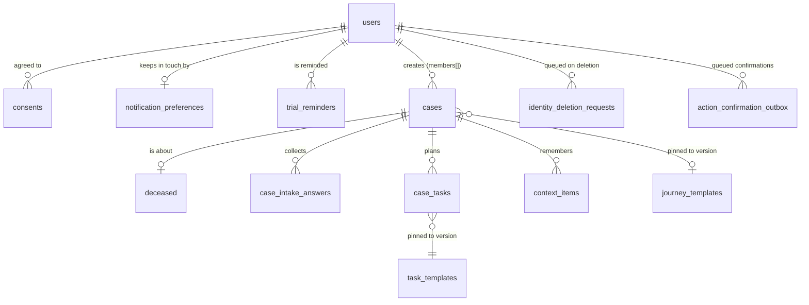

# Data model

MongoDB 7.0 or newer, as a replica set (MongoDB Atlas in production). One database, `cairn` by default (`CAIRN_MONGODB_DB`). The whole schema (collections, `$jsonSchema` and `$expr` validators, indexes, roles, and settings) is in one file, [`database/db/schema.py`](../../database/db/schema.py), and [`database/db/apply.py`](../../database/db/apply.py) makes a database match it.

For the reasoning behind the model, read [database/docs/cairn-mvp-data-model.md](../../database/docs/cairn-mvp-data-model.md) (the MVP) and [database/docs/cairn-conceptual-data-model.md](../../database/docs/cairn-conceptual-data-model.md) (the full future model). The decisions and invariants are in [database/CLAUDE.md](../../database/CLAUDE.md).

## Collections

| Group | Collection | What it holds |
|---|---|---|
| **Account** | `users` | One per account: sign-in subject and linked identities, onboarding step, adult yes or no, preferred name, voice, the trial, `access` and `subscription_status`, break fields, check-in time. Never a name or photo from a sign-in provider (`name_prefill` is always null) |
| | `consents` | Append-only acknowledgments (privacy and terms, trial terms, AI notice, subscription terms) with the policy version and time |
| | `trial_reminders` | Scheduled trial-ending notes |
| **Case** (inside the case boundary) | `cases` | One per family journey: `members` (owner only at MVP), status, the pinned journey template, attorney triggers, timing |
| | `deceased` | The person who died. Never collected on a draft. Only the last four digits of an SSN, ever |
| | `case_intake_answers` | Only the spec's `data_fields`, each value shape-checked twice. No free text |
| | `case_tasks` | The family's steps, each pinned to the exact template version shown |
| | `context_items` | Small structured context (`CERT_ORDER`, `FUNERAL`, `BANK_NOTICES`, `CONVO_SUMMARY`) |
| | `notification_preferences` | Channels (email, in-app, browser), frequency, quiet hours, the browser push endpoint |
| | `notification_log` | That a reminder was sent. Never content or an address |
| **Content** (read-only to the app) | `task_templates` | Versioned task templates with citations. A correction is a new version, never an edit |
| | `journey_templates` | Versioned journey templates |
| **Queues** (jobs only) | `identity_deletion_requests` | Auth0 users and Apple tokens to remove after an account is deleted |
| | `action_confirmation_outbox` | Confirmation emails waiting to go. The address is purged once sent |
| | `action_confirmation_log` | That a confirmation went. No content, no address |
| **Billing** | `stripe_events` | Stripe event ids, types, and times, so each is applied once. Never a payload |
| **Operations** | `audit_events` | Append-only, opaque ids only. Write-only for the app and the jobs |
| | `safety_referral_counts` | An anonymous monthly count of crisis referrals: no user, no case, no time of day |
| | `app_settings` | `draft_retention_days` (28), `trial_reminder_days_before` (7), `case_deletion_hold_days` (7) |
| | `job_locks` | Stops two job runs from claiming the same work |
| | `schema_migrations` | Which numbered data migrations in `apply.py` have run, with checksums |

Every collection has `additionalProperties: false`, so a field that isn't in `schema.py` can't be written at all.

There is no document upload, vault, or object store at MVP (decision 5).

## Who can touch what

Each process connects as its own MongoDB user, and each user holds exactly one custom role. `ROLES` in `schema.py` is the source of truth. RW means find, insert, update, and remove.

| Collection | `cairnApp` (API) | `cairnJobs` (jobs) | `cairnLoader` (deploy) |
|---|---|---|---|
| `users` | RW | find, update, remove | |
| `consents` | find, insert, remove | find, remove | |
| `cases`, `deceased`, `case_intake_answers`, `case_tasks`, `context_items` | RW | find, remove (`cases`: also update) | |
| `notification_preferences` | RW | find, update, remove | |
| `notification_log` | find, remove | find, insert, remove | |
| `trial_reminders` | find, insert, remove | find, update, remove | |
| `task_templates`, `journey_templates` | find | | find, insert, update (`active` only) |
| `app_settings` | find | find | |
| `audit_events` | insert | insert | |
| `identity_deletion_requests` | insert | RW | |
| `action_confirmation_outbox` | insert, remove | RW | |
| `action_confirmation_log` | | insert | |
| `safety_referral_counts` | insert, update | find | |
| `stripe_events` | find, insert, update | find, update | |
| `job_locks` | | find, insert, update | |

No Cairn role has `bypassDocumentValidation` or any user-management action, and `test_no_cairn_role_can_bypass_validation_or_manage_users` checks that. An administrator (`CAIRN_ADMIN_MONGODB_URI`) is used only by `apply.py` and the one-time PostgreSQL move, never by a running service.

## The case boundary

MongoDB has no row-level security, and the roles are per collection, not per document. So the rule "a person sees only their own cases" lives in one place, [`api/cairn_api/store.py`](../../api/cairn_api/store.py):

- Every read and write the API makes goes through a `store.Session`, one per request transaction. `test_only_the_data_layer_touches_mongodb` fails if another API module imports `pymongo`.
- Case data is reached only through a case id that passed the visibility filter (`_visible`). A case the caller isn't a member of looks exactly like one that doesn't exist.
- Writes need an `owner` (or later `co_executor`) membership through `_case_for_write`, plus `account_can_write()`. Deleting never checks either, so data can always be deleted.
- A new case-scoped collection goes in `CASE_SCOPED`, so it's deleted with its case.

The validators in `schema.py` are the backstop: they bind every writer, including a bug in `store.py`.

## Lifecycle and retention

| What | When it's deleted | By |
|---|---|---|
| A case the user deletes now | Immediately, with everything in `CASE_SCOPED` | API |
| A case deleted with a hold | 7 days later (UC-END-13) | `purge_held_cases`, hourly |
| An idle draft case | After 28 days with no activity (DEC-07) | `purge_inactive_drafts`, daily |
| An account the user deletes | Immediately. Auth0 users and Apple tokens follow | API, then `identity_cleanup` every 15 minutes |
| A sign-up never finished | 90 days after it was created (D-2026-10-05-R1) | `purge_stale_accounts`, daily |
| A finished account with no case | Kept. Period not decided **[LEGAL REVIEW REQUIRED]** | `purge_stale_accounts` once `CAIRN_NO_CASE_ACCOUNT_RETENTION_DAYS` is set |
| `audit_events`, `cases.purge_after` | Period not decided **[LEGAL REVIEW REQUIRED]** | |

## Changing the schema

Edit `schema.py` and run `apply.py` (locally `make db-apply`, in deploys `deploy-database.yml`). Validators update in place with `collMod` and new indexes are added. An index whose definition changed is reported, never dropped. A change that rewrites existing documents goes in `MIGRATIONS` in `apply.py` as a new numbered function. Never edit one that has run anywhere: `apply.py` refuses a changed checksum.

On Atlas, roles are managed in Atlas, not by `apply.py`. After changing `ROLES`, print them with `python3 database/db/apply.py --print-roles --db cairn` and update them in Atlas to match.
