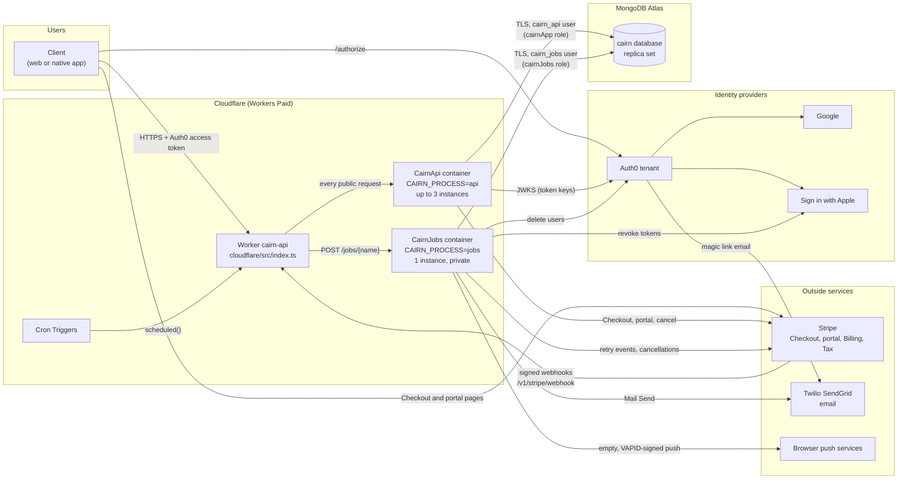
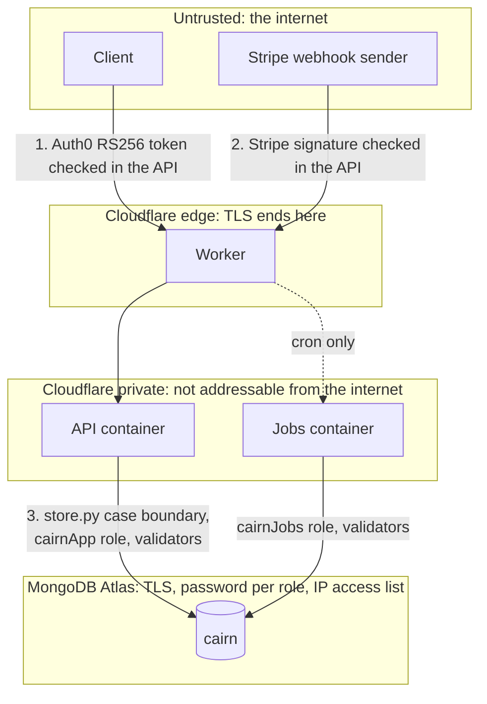
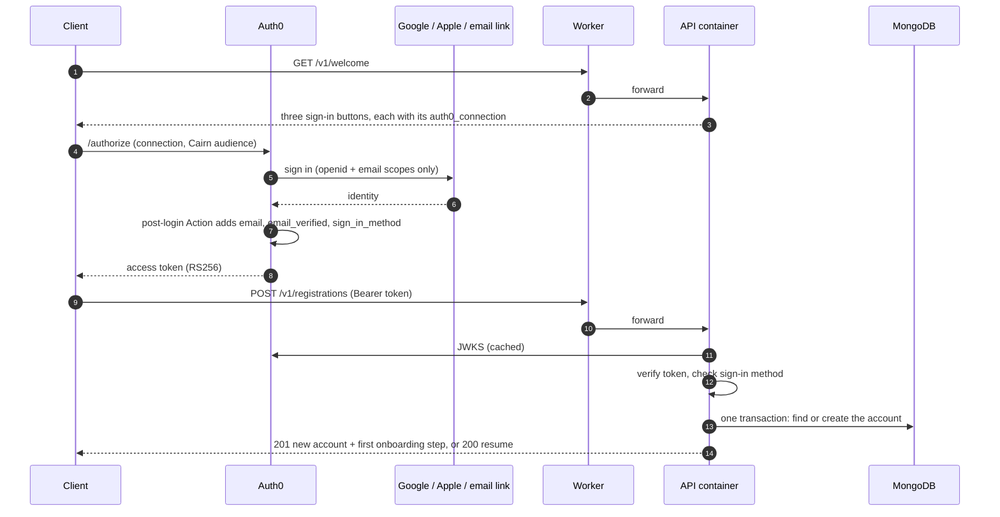
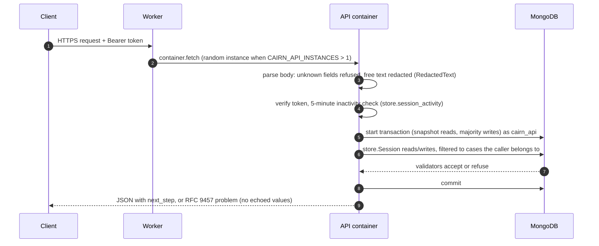
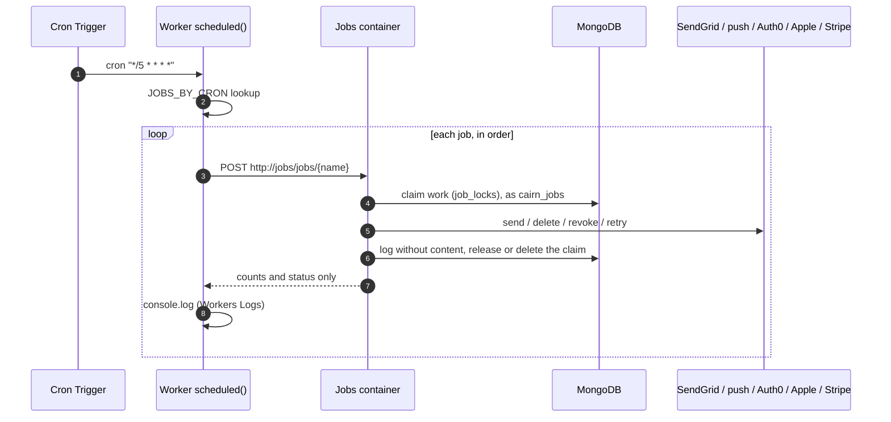
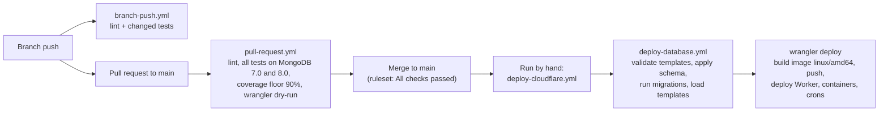

# Architecture overview

Cairn is one Python API (FastAPI) and one scheduled jobs service, built from the same container image and run on Cloudflare Containers behind a small Cloudflare Worker. Data lives in MongoDB Atlas. Sign-in is Auth0, payments are Stripe, and every email goes out through Twilio SendGrid.

- [System diagram](#system-diagram)
- [Runtime components](#runtime-components)
- [Trust boundaries](#trust-boundaries)
- [Flows](#flows): [sign-in and registration](#sign-in-and-registration), [a signed-in request](#a-signed-in-request), [buying a subscription](#buying-a-subscription), [a scheduled job](#a-scheduled-job), [deploying](#deploying)
- [Repository map](#repository-map)

## System diagram



## Runtime components

| Component | Code | Runs on | Talks to | Holds |
|---|---|---|---|---|
| **Worker** `cairn-api` | `cloudflare/src/index.ts`, `cloudflare/wrangler.jsonc` | Cloudflare Workers | The two containers | Every Worker var and secret. Passes each container only its own list (`API_KEYS`, `JOBS_KEYS`) |
| **API container** (`CairnApi`) | `api/cairn_api/main.py` and `routers/` | Cloudflare Containers, `basic` instance, up to `max_instances: 3`, sleeps after 15 minutes idle | MongoDB as `cairn_api`, Auth0 (JWKS), Stripe | The `cairn_api` connection string, the Stripe key and webhook secret, the public VAPID key |
| **Jobs container** (`CairnJobs`) | `api/cairn_api/jobs.py`, `maintenance.py`, `outbound.py`, `identity_cleanup.py` | Cloudflare Containers, 1 instance, sleeps after 5 minutes idle. No public route | MongoDB as `cairn_jobs`, SendGrid, push services, Auth0 Management API, Apple, Stripe | The `cairn_jobs` connection string and every provider secret |
| **Database** | `database/db/schema.py` (applied by `database/db/apply.py`) | MongoDB Atlas, M10 or larger, replica set | Nothing | All user and case data. See [Data model](data-model.md) |
| **Content** | `database/content/`, `journeys/`, `voices/` | Loaded into MongoDB at deploy (templates), or baked into the image (voices, copy) | n/a | Task and journey templates, the voices, and the user-facing copy |
| **Identity** | `auth0/actions/cairn-claims.js` | Auth0 | Google, Apple, SendGrid | Sign-in. Cairn never sees a password |

One image, two processes: `CAIRN_PROCESS=api` (default) serves the API and `CAIRN_PROCESS=jobs` serves the jobs. Both run `python -m cairn_api.serve` as a non-root user (uid 10001) on port 8080. The image bakes in no secrets.

### Why the API and the jobs are separate containers

The jobs need powers the API must never have: deleting held cases, reading the outbound queue, sending email, and deleting Auth0 users. Putting them in a second container means:

- The API container never receives the jobs' connection string or any provider secret except Stripe's.
- No public request can reach the jobs. The Worker sends public traffic only to `CairnApi`. `CairnJobs` is reached only from `scheduled()`.
- The jobs connect as a different MongoDB user whose role allows purges and sends but not the API's writes. See [Security model](../security/overview.md#least-privilege-database-roles).

## Trust boundaries



Every request crosses three checks before it touches data:

1. **Who is calling.** The API verifies the Auth0 access token (RS256, issuer, audience, `sub`, `exp`, `iat`) and refuses it after 5 minutes of inactivity. Stripe's webhook instead carries an HMAC signature checked against `CAIRN_STRIPE_WEBHOOK_SECRET`.
2. **What they may touch.** `api/cairn_api/store.py` is the only module that reads or writes case data. A case the caller isn't a member of looks exactly like one that doesn't exist.
3. **What the database will accept.** The `cairnApp` role allows only find, insert, update, and remove on named collections, and every collection has a validator that no Cairn role can bypass.

Details are in [Security model](../security/overview.md).

## Flows

### Sign-in and registration



Onboarding then moves one step at a time, in order: adult (yes or no, never an age), the privacy and terms, trial terms, and AI notice acknowledgments, name, voice, and notification choices. See [auth0/README.md](../../auth0/README.md#client-flow) for linking a second sign-in method.

### A signed-in request



Each request is one multi-document transaction, so its changes land together or not at all. That's why MongoDB has to be a replica set. A write conflict with a concurrent request answers 409 `try_again`.

### Buying a subscription

Cairn is free for 28 days from the first journey, then $14.99 a month (D-04). Cairn never sees a card, bank account, or billing address. Access changes only from Stripe's signed events, never from what the browser reports.

```mermaid
sequenceDiagram
    autonumber
    participant C as Client
    participant API as API (through the Worker)
    participant S as Stripe
    participant DB as MongoDB

    C->>API: POST /v1/me/subscription/checkout
    API->>S: create Checkout Session (account id + sign-in email only,<br/>price from CAIRN_SUBSCRIPTION_PRICE_CENTS, automatic tax)
    S-->>API: session URL
    API-->>C: URL (not stored)
    C->>S: pay on Stripe's hosted page
    S-->>C: redirect to CAIRN_APP_URL
    C->>API: GET /v1/me/subscription/checkout-result (display only)
    S->>API: POST /v1/stripe/webhook (Stripe-Signature)
    API->>API: verify HMAC + timestamp (5-minute tolerance)
    API->>DB: record event id once (ids, type, times; never the payload)
    API->>S: read the subscription's current state
    API->>DB: apply_stripe_state: users.access, subscription_status
    Note over API,DB: If applying fails, the jobs' process_stripe_events retries every 15 minutes
```

Payment details and past invoices are on Stripe's customer portal (`POST /v1/me/subscription/portal`). Cancelling and undoing a cancellation go through the Subscriptions API. Setup is in [Payments (Stripe)](../setup/04-stripe.md).

### A scheduled job



| Cron (UTC) | Jobs |
|---|---|
| `*/5 * * * *` | `outbound`: confirmations, the trial-ending note, chosen reminders, check-ins, break-ending notices, the yearly renewal reminder |
| `*/15 * * * *` | `identity_cleanup`, `process_stripe_events`, `retry_cancellations` |
| `7 * * * *` | `purge_held_cases`, `settle_trial_clocks`, `sync_early_subscriptions` |
| `30 3 * * *` | `purge_inactive_drafts`, `expire_trials`, `purge_stale_accounts`, `price_change_notices` |

A job whose provider isn't configured answers `"skipped"` instead of failing. To change a schedule, edit `triggers.crons` in `wrangler.jsonc` and `JOBS_BY_CRON` in `src/index.ts` together.

### Deploying



Deploys run only by hand. Cloudflare Workers Builds is deliberately not connected, because it would deploy without applying the schema first. A rollback (`npx wrangler rollback`) reverts the Worker and image but not the schema, so keep schema changes backward compatible for one release. See [GitHub](../setup/08-github.md) and [Cloudflare](../setup/07-cloudflare.md).

## Repository map

| Folder | What's in it | Reference |
|---|---|---|
| `api/` | The API, the jobs, tests, and the OpenAPI contract | [api/README.md](../../api/README.md) |
| `database/` | Schema, validators, roles, template loader, tools, specs | [database/README.md](../../database/README.md), [database/CLAUDE.md](../../database/CLAUDE.md) |
| `journeys/` | Journey templates, jurisdictions, sources, and their tools | [journeys/README.md](../../journeys/README.md) |
| `voices/` | The four voices and the shared core rules | [voices/README.md](../../voices/README.md) |
| `auth0/` | Tenant setup and the post-login Action | [auth0/README.md](../../auth0/README.md) |
| `cloudflare/` | The Worker and its configuration | [Cloudflare setup](../setup/07-cloudflare.md) |
| `.github/` | CI, deploy workflows, ruleset | [.github/README.md](../../.github/README.md) |
| `.devcontainer/`, `scripts/` | Codespaces environment and local setup | [Local development](../setup/local-development.md) |
| `docs/` | These pages | [docs/README.md](../README.md) |
