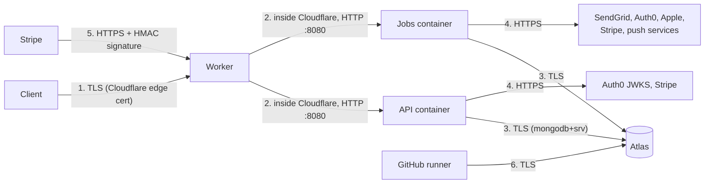

# Encryption

What's encrypted in transit and at rest, hop by hop, who holds the keys, and what's still open.

- [In transit](#in-transit)
- [At rest](#at-rest)
- [What's never stored, so needs no encryption](#whats-never-stored-so-needs-no-encryption)
- [Hashing and signing](#hashing-and-signing)
- [Gaps](#gaps)

## In transit

| # | Hop | Protection | Configured in |
|---|---|---|---|
| 1 | Client to Cloudflare | TLS, with a certificate Cloudflare issues and renews for `workers.dev` or the custom domain. Set **Minimum TLS Version 1.2**, **Always Use HTTPS**, and **HSTS** on the zone | Cloudflare dashboard, [7.5](../setup/07-cloudflare.md#75-custom-domain-and-edge-settings) |
| 2 | Worker to containers | Stays inside Cloudflare's network. The containers have no public address. Cairn doesn't add TLS on this hop, and `serve.py` trusts forwarded headers because TLS ends at the Worker | `cloudflare/src/index.ts`, `api/cairn_api/serve.py` |
| 3 | Containers to MongoDB Atlas | TLS. Atlas requires TLS on every connection, and `mongodb+srv://` turns it on in the driver. Authenticated with SCRAM, one user per role | Atlas, the connection strings |
| 4 | Containers to providers | HTTPS through `httpx`, which verifies certificates by default. Nothing in the code turns verification off | `stripe_client.py`, `twilio_client.py`, `identity_cleanup.py`, `webpush.py`, `auth.py` |
| 5 | Stripe to the webhook | HTTPS to the Worker, plus an HMAC-SHA256 signature over the body and a timestamp, checked against `CAIRN_STRIPE_WEBHOOK_SECRET` with a 5-minute tolerance against replays | `stripe_client.verify_webhook` |
| 6 | Deploy workflow to Atlas | TLS, admin and loader users, runner IP admitted only for the run when the Atlas API key is set | `deploy-database.yml` |
| | Auth0 to Google and Apple, Auth0 to SendGrid | HTTPS, managed by Auth0 | Auth0 |
| | Browser push | The push is **empty**, signed with VAPID (ES256). No message content travels through the vendor's push service, so there's nothing for RFC 8291 payload encryption to protect | `webpush.py` |
| | Email | SendGrid sends with opportunistic TLS to the receiving mail server. Email isn't end-to-end encrypted, which is why outbound text never names the person who died, the circumstance, or task details | `outbound.py` |
| | Local SMTP (development only) | STARTTLS | `outbound.py` |
| | Local MongoDB (development only) | No TLS, `localhost` or the Codespace's private network | `.devcontainer/` |

## At rest

| Where | What's there | Encryption | Keys held by |
|---|---|---|---|
| **MongoDB Atlas cluster** | All user and case data | Atlas encrypts all cluster storage at rest by default (AES-256 volume encryption). Optional **Customer Key Management** adds a layer with your own AWS KMS, Azure Key Vault, or Google Cloud KMS key **[DECISION NEEDED]** | MongoDB and the cloud provider, or you with CMK |
| **Atlas backups** | Snapshots of the above | Encrypted like the cluster. With CMK, snapshots use your key too | Same |
| **Cloudflare Worker secrets** | Every runtime secret | Encrypted by Cloudflare. Write-only once set: not shown in the dashboard or by `wrangler` | Cloudflare |
| **Container disk** | Nothing Cairn writes. The image holds code, voices, and copy only | Ephemeral. Gone when the container stops | n/a |
| **Durable Object storage** | The container classes are Durable Objects with SQLite storage (`new_sqlite_classes`), used by `@cloudflare/containers` for its own bookkeeping. Cairn stores no user data there | Encrypted at rest by Cloudflare | Cloudflare |
| **Workers Logs** | Request logs and job results. Jobs log counts and codes only. API log lines pass through `RedactingFilter` | Cloudflare-managed | Cloudflare |
| **GitHub secrets** | Deploy and test credentials | Encrypted by GitHub (sealed boxes). Masked in logs | GitHub |
| **Auth0** | Email address, sign-in identities, Apple and Google tokens | Auth0-managed | Auth0 |
| **Stripe** | Card and bank details, billing address, invoices | Stripe-managed, PCI DSS Level 1. Cairn never receives these | Stripe |
| **SendGrid** | Recent message activity (recipient, status) | Twilio-managed | Twilio |
| **Laptops and Codespaces** | `.env`, `cloudflare/.dev.vars`, the local test database | Whatever the disk has. Use full-disk encryption. Never put production values here | You |

### Application-layer encryption

There is **none** today. The data model plans it for the most sensitive fields (`database/docs/cairn-conceptual-data-model.md` marks a full SSN and VA file number as "app-layer encrypted"), but the MVP avoids needing it by not collecting them:

- Only the **last four digits** of an SSN are collected (`deceased.ssn_last4`). Full SSNs and VA file numbers are deferred (decision 6).
- **Phone numbers** aren't stored at all, because text messages aren't in the MVP. The rule is that a number is never stored in plain text: adding SMS needs an encrypted field and its key management first.

Whether to add MongoDB **Client-Side Field Level Encryption** or **Queryable Encryption** for `ssn_last4` and legal names is open (`database/CLAUDE.md`, open question 5). If it's adopted, the data key lives in a cloud KMS, the API container gets KMS access, and the jobs and loader don't need it.

## What's never stored, so needs no encryption

Not collecting something is stronger than encrypting it. These never reach the database or a log:

| Never stored | How it's enforced |
|---|---|
| Passwords and passkeys | Auth0 owns sign-in. The API only sees signed tokens |
| Card numbers, bank accounts, billing addresses | Stripe Checkout and the portal are Stripe's pages. `stripe_events` holds ids, type, and times only |
| Checkout and portal URLs | Returned to the client, never saved |
| Free text the person types or speaks | Redacted while the request is parsed (`RedactedText`), used for that turn, and discarded. Only confirmed field values are saved. Audio never reaches the API |
| SSNs, card and account numbers typed into chat | `redaction.redact` removes them before any handler, log, or reply sees them |
| Anything about the person's emotional state or distress | The safety level lives in the client-held session. A crisis stores only a trial pause, break fields without a reason, an opted-in check-in time, and an anonymous monthly count |
| Names or photos from Google or Apple | `users.name_prefill` can only be null |
| An age or birthdate of the user | Only "18 or older: yes or no" and its time |
| Email or push content after sending | The outbox address is purged once sent. Logs hold no content or address |

## Hashing and signing

| What | Algorithm | Purpose |
|---|---|---|
| Auth0 access tokens | RS256, verified against Auth0's JWKS | Who's calling |
| Development tokens | HS256 with `CAIRN_DEV_AUTH_SECRET` | Local test logins only |
| Test login passwords | PBKDF2-SHA256 with salt (`cairn_dev.test_logins`) | Local test logins only |
| Stripe webhooks | HMAC-SHA256, constant-time comparison | The event is from Stripe |
| VAPID | ES256 JWT | The push is from Cairn |
| Apple client secret | ES256 JWT signed with the `.p8` key | Calling Apple's revoke endpoint |
| Template `content_hash` | SHA-256 | Identifies a template version's exact content |
| Schema and migration checksums | SHA-256 | `apply.py` refuses an edited migration |

## Gaps

| Gap | Risk | Suggested fix |
|---|---|---|
| No field-level encryption for `ssn_last4` and legal names **[DECISION NEEDED]** | Anyone with database read access (an Atlas admin, a backup, a leaked `cairn_api` password) sees them in clear | Decide open question 5. If yes, Queryable Encryption with a KMS-held key |
| Atlas IP access list open to the internet **[DECISION NEEDED]** | A leaked connection string works from anywhere | Open question 12: a fixed-egress proxy, or Atlas private networking if Cloudflare offers a path. Meanwhile long random passwords and fast rotation |
| No security headers from the API (HSTS, `X-Content-Type-Options`, `Content-Security-Policy` for `/docs`) **[GAP]** | Downgrade on first visit, MIME sniffing | Turn on HSTS at the Cloudflare zone, or add headers in the Worker |
| Worker-to-container hop isn't TLS | Relies on Cloudflare's internal network | Accept, and record it in the threat model |
| Customer Key Management not decided **[DECISION NEEDED]** | Keys are MongoDB's, not Cairn's | Decide with counsel and customers' expectations |
| Swagger UI and `/openapi.json` are public in production **[DECISION NEEDED]** | Gives attackers a map. Not a leak of data | Turn them off when not in development, or put them behind Cloudflare Access |
