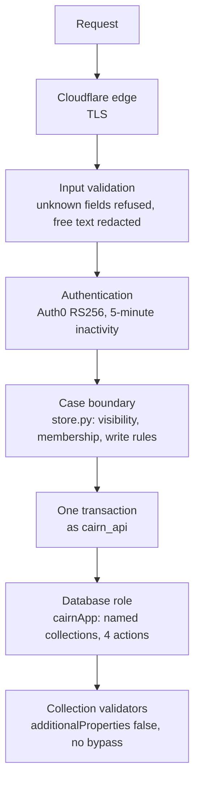

# Security model

Cairn holds the identity of a person who has died, where and how they died, veteran and will status, part of an SSN, and who is authorized to act, all at one of the worst moments in a family's life. Security and privacy come first. This page explains the controls. [Secrets](secrets.md) and [Encryption](encryption.md) go deeper on those two topics.

The rules that must never be weakened are listed in full in [database/CLAUDE.md, "Security invariants"](../../database/CLAUDE.md#security-invariants-do-not-weaken). The tests that hold them are in `api/tests/test_data_security.py`.

## Layers

Each layer assumes the one before it can fail.

## The case boundary

MongoDB has no row-level security, so "a person sees only their own cases" is enforced in one data-access layer, `api/cairn_api/store.py`:

- Every read and write goes through a `store.Session`. A test fails if any other API module imports `pymongo`.
- A case is visible only to its creator and active members. A case you can't see answers exactly like one that doesn't exist.
- Writing to a case needs an owner membership and an account that can write. Deleting never checks either, so people can always delete their data.
- Account fields the person can't set (onboarding step, access, the trial, the subscription) are written only by the methods that own them.
- `consents` and `audit_events` are append-only.

See [Data model](../architecture/data-model.md#the-case-boundary).

## Least-privilege database roles

Three custom roles, one per process, and an administrator that no running service uses. No role has `bypassDocumentValidation` or user-management actions. The full matrix is in [Data model](../architecture/data-model.md#who-can-touch-what). Highlights:

- The API **can't read** audit rows, the identity deletion queue, the confirmation outbox, or the confirmation log. It can only add to them.
- The jobs **can't touch** templates and can't add or delete Stripe events.
- The loader can only add template versions and flip their `active` flag.

## The API and jobs split

The API and the jobs run in separate containers with separate database users and separate secrets. Public traffic reaches only the API. The jobs container holds the powerful credentials (purging, sending email, deleting Auth0 users) and is reached only by the Worker's cron handler. See [Architecture](../architecture/overview.md#why-the-api-and-the-jobs-are-separate-containers).

## Sign-in and sessions

- **Auth0 owns sign-in** for Google, Apple, and email. Cairn never handles a password or passkey.
- **Tokens:** RS256 only, issuer and audience checked, `sub`, `exp`, and `iat` required. The post-login Action and the API both refuse any connection other than the three supported ones.
- **Inactivity:** a token issued before more than 5 minutes of inactivity gets 401 `session_timed_out` (D-20). Sign-in is required again after 30 days.
- **Linking sign-in methods** happens only from a session signed in with a method the account already has, with the new token verified too. Accounts are never linked automatically.
- **Scopes:** Google and Apple are asked for `openid` and `email` only. Cairn never takes a name or photo from them.
- **Account deletion** removes the data at once, then the jobs delete the Auth0 users and revoke the Apple tokens.

### Development sign-in

`POST /v1/dev/token` signs in fake test logins without Auth0, for local work. It's kept out of production four ways: it answers 404 unless `CAIRN_DEV_AUTH_SECRET` is set; the Worker never passes that setting to a container; the logins live in a `cairn_dev` database that only the local seed script creates; and the seed refuses any non-local or Atlas host.

## Privacy controls

| Control | Where |
|---|---|
| Free text is redacted while the request is parsed, so no handler, log, model, or database ever sees an SSN, card, or account number | `redaction.py`, `schemas.RedactedText` |
| A logging filter redacts sensitive numbers from every API log line, as a second layer | `main.py`, `RedactingFilter` |
| Errors use RFC 9457 problem details and never echo submitted values or database messages | `errors.py` |
| Nothing about a person's distress is stored. The safety level lives in the client-held session | `safety.py`, decision 7 |
| Outbound messages are checked to name no person who died, no circumstance, and no task details before sending. Browser pushes carry no text | `outbound.py`, `webpush.py` |
| No open or click tracking on email, no marketing, no analytics | `twilio_client.py`, D-07 |
| Stripe and SendGrid receive the minimum: Stripe gets the account id and sign-in email only | `stripe_client.py`, SUB-D-10 |
| Unknown request fields are refused, and every collection refuses unknown fields | `schemas.py`, `schema.py` |
| Retention: drafts, held cases, unfinished sign-ups, and deleted accounts are purged on a schedule | [Data model](../architecture/data-model.md#lifecycle-and-retention) |
| People can download and delete all their data at any time, including on a read-only account | `export.py`, `store.delete_my_account` |

## The container

- `python:3.12-slim`, runs as a non-root system user (uid 10001), and the application files are read-only for that user.
- No secret is baked into the image. Every setting arrives as an environment variable.
- The jobs app has no Swagger UI or OpenAPI document.

## CI as a control

- Every pull request runs the data security suite on MongoDB 7.0 and 8.0, connected as a real `cairnApp` user. A skipped test fails the run.
- 90% coverage floor for `cairn_api`.
- `api/openapi.json` must match the code, so contract changes are visible in review.
- The ruleset requires a pull request and the **All checks passed** job before `main` changes, and blocks force pushes.
- Deploys need a person to run them, and the deploy environment can require a reviewer.

## Open items

| Item | Notes |
|---|---|
| Field-level encryption for `ssn_last4` and legal names **[DECISION NEEDED]** | [Encryption: gaps](encryption.md#gaps) |
| Atlas access list open to the internet **[DECISION NEEDED]** | `database/CLAUDE.md`, open question 12 |
| Swagger UI (`/docs`) and `/openapi.json` are public in production **[DECISION NEEDED]** | FastAPI serves them by default. Turn them off outside development or put them behind Cloudflare Access |
| No security headers (HSTS and others) from the API **[GAP]** | Set HSTS at the Cloudflare zone |
| No rate limiting **[GAP]** | Add Cloudflare rate limiting rules on the custom domain, at least for `/v1/registrations` and `/v1/stripe/webhook` |
| Dependabot alerts, security updates, and secret scanning are repository settings, not code. Check they're on | [GitHub 8.4](../setup/08-github.md#84-dependency-updates) |
| Audit events for reads of sensitive records | `database/CLAUDE.md`, suggested task 3 |
| Clinical sign-off of the crisis phrase list | DEC-26-06 |
| Security review of sign-in email recovery (UC-REG-20) | `database/docs/support-sign-in-email-recovery.md` |
| Atlas database auditing, backups, restore drills | `database/CLAUDE.md`, suggested task 5 |
