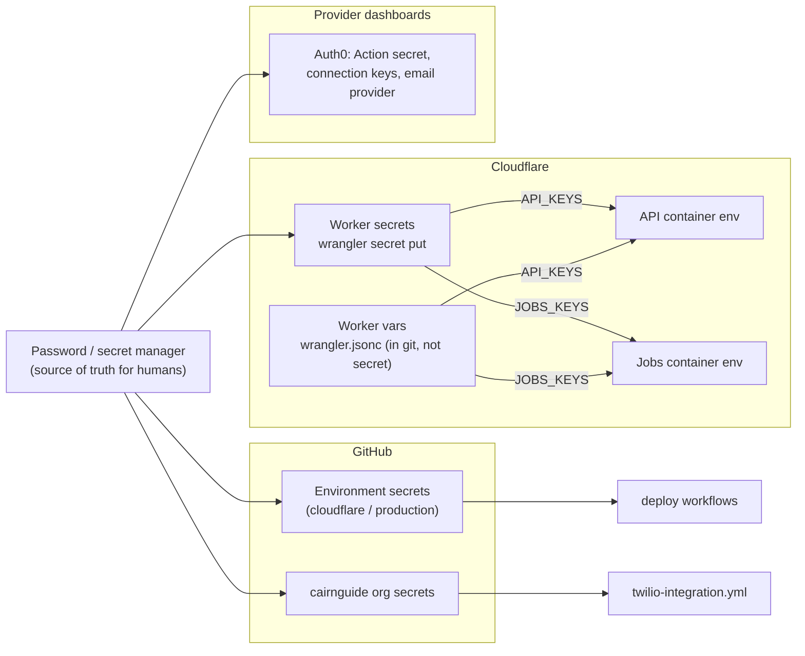

# Secrets

Every credential Cairn uses: what it is, where it's stored, which process receives it, and how to rotate it.

- [Rules](#rules)
- [Where secrets live](#where-secrets-live)
- [Inventory](#inventory)
- [Non-secret configuration](#non-secret-configuration)
- [Rotation](#rotation)
- [If a secret leaks](#if-a-secret-leaks)

## Rules

1. **Never in the repository.** No secret in code, `wrangler.jsonc`, a workflow file, a test fixture, or a commit message. `.env` and `cloudflare/.dev.vars` are gitignored and hold development values only.
2. **Each process gets only its own.** The Worker holds every Cloudflare secret, but passes the API container only the names in `API_KEYS` and the jobs container only those in `JOBS_KEYS` (`cloudflare/src/index.ts`). The jobs' database login and the provider secrets never reach the API.
3. **Least privilege at the provider too.** Each key is scoped to what the code calls: one MongoDB role per user, a Mail Send-only SendGrid key, a restricted Stripe key, three Auth0 Management scopes.
4. **Never logged.** Errors from providers keep a status and an error code, never the response body. Jobs log counts only. A logging filter redacts sensitive numbers from every API log line.
5. **Development sign-in never reaches production.** `CAIRN_DEV_AUTH_SECRET` is not in either list in `index.ts`, so a deployed container can't receive it, and `POST /v1/dev/token` answers 404 without it.

The Python side reads every secret with `config.secret_from_env(NAME)`: the value of `NAME`, or the contents of the file named by `NAME_FILE`. Cloudflare passes values as environment variables. A host that mounts secret files can use `_FILE`.

## Where secrets live

| Store | Holds | Who can read values |
|---|---|---|
| Your password or secret manager | The original of every secret below | The people you share it with |
| Cloudflare Worker secrets | Everything the containers need | Nobody, once set. Write-only in the dashboard and `wrangler`. The running Worker only |
| `cloudflare/wrangler.jsonc` `vars` | Non-secret settings only | Anyone with repository access |
| GitHub environment secrets | Deploy credentials | Workflows running in that environment, after its reviewers approve |
| GitHub organization secrets | Twilio credentials for the live checks | Workflows in repositories the secret is shared with |
| Auth0 tenant | The Action's `CLAIM_NAMESPACE`, Google client secret, Apple key, SendGrid key (email provider) | Auth0 tenant admins |
| `.env`, `cloudflare/.dev.vars` | Development values | Your machine or Codespace. Gitignored |

## Inventory

"API" and "Jobs" mean the value is in `API_KEYS` or `JOBS_KEYS`.

### Runtime secrets (Cloudflare Worker secrets)

| Name | Received by | What it is | Where it comes from | Rotation |
|---|---|---|---|---|
| `MONGODB_URI` | API | Connection string for `cairn_api` (`cairnApp` role) | Atlas, [2.3](../setup/02-database.md#23-create-the-login-users) | [Database passwords](#database-passwords) |
| `CAIRN_JOBS_MONGODB_URI` | Jobs | Connection string for `cairn_jobs` (`cairnJobs` role) | Atlas | [Database passwords](#database-passwords) |
| `CAIRN_STRIPE_SECRET_KEY` | API, Jobs | Restricted or secret Stripe key | Stripe, [4.2](../setup/04-stripe.md#42-create-an-api-key) | [Stripe](#stripe) |
| `CAIRN_STRIPE_WEBHOOK_SECRET` | API | Webhook signing secret (`whsec_...`) | Stripe, [4.4](../setup/04-stripe.md#44-create-the-webhook-after-the-first-deploy) | [Stripe](#stripe) |
| `TWILIO_SENDGRID_API_KEY` | Jobs (and Auth0's email provider) | Mail Send-only SendGrid key | SendGrid, [5.2](../setup/05-twilio.md#52-create-the-api-key) | [SendGrid](#sendgrid) |
| `CAIRN_EMAIL_FROM` | Jobs | The sender address. Not really secret, set as one today | You | Change any time |
| `TWILIO_ACCOUNT_SID`, `TWILIO_AUTH_TOKEN` | Jobs | Twilio account credentials for texts and Verify. Not used in the MVP | Twilio console | [Twilio](#twilio-account) |
| `CAIRN_AUTH0_MGMT_CLIENT_ID`, `CAIRN_AUTH0_MGMT_CLIENT_SECRET` | Jobs | Auth0 Management API client (`read:users`, `read:user_idp_tokens`, `delete:users`) | Auth0, [3.10](../setup/03-auth0.md#310-the-management-api-client-for-account-deletion) | [Auth0](#auth0-management-client) |
| `CAIRN_APPLE_PRIVATE_KEY` | Jobs | Sign in with Apple `.p8` key (ES256), to revoke Apple tokens | Apple Developer, [3.4](../setup/03-auth0.md#34-apple) | [Apple](#apple-key) |
| `CAIRN_APPLE_CLIENT_ID`, `CAIRN_APPLE_TEAM_ID`, `CAIRN_APPLE_KEY_ID` | Jobs | Identifiers that go with the key | Apple Developer | With the key |
| `CAIRN_VAPID_PRIVATE_KEY` | Jobs | Browser notification signing key (P-256 PEM) | `openssl`, [6.1](../setup/06-browser-notifications.md#61-make-the-key-pair) | [VAPID](#vapid-key) |
| `CAIRN_SMTP_PASSWORD` | Jobs | SMTP password. Local development only | Your mail catcher | n/a |

### Deploy secrets (GitHub environment secrets)

| Name | Used by | What it is | Rotation |
|---|---|---|---|
| `CLOUDFLARE_API_TOKEN` | `deploy-cloudflare.yml` | Token with Workers and Containers edit on one account | Roll in Cloudflare (My Profile > API Tokens), update the secret |
| `CLOUDFLARE_ACCOUNT_ID` | `deploy-cloudflare.yml` | Account id. Not really secret | n/a |
| `CAIRN_ADMIN_MONGODB_URI` | `deploy-database.yml` | An Atlas administrator, for `apply.py` | [Database passwords](#database-passwords) |
| `CAIRN_LOADER_MONGODB_URI` | `deploy-database.yml` | `cairn_loader` (`cairnLoader` role) | [Database passwords](#database-passwords) |
| `ATLAS_PUBLIC_KEY`, `ATLAS_PRIVATE_KEY`, `ATLAS_PROJECT_ID` | `deploy-database.yml` | Atlas API key with Project IP Access List Admin, optional | Create a new key in Atlas, update, delete the old |

### Test secrets (GitHub repository or organization secrets)

| Name | Used by |
|---|---|
| `TWILIO_ACCOUNT_SID`, `TWILIO_AUTH_TOKEN`, `TWILIO_SENDGRID_API_KEY` (org) | `twilio-integration.yml` |
| `TWILIO_FROM_NUMBER`, `TWILIO_MESSAGING_SERVICE_SID`, `TWILIO_VERIFY_SERVICE_SID`, `CAIRN_EMAIL_FROM`, `TWILIO_TEST_TO_NUMBER`, `TWILIO_TEST_TO_EMAIL` | `twilio-integration.yml` |

### Secrets held by providers

| Secret | Held in | What it is |
|---|---|---|
| `CLAIM_NAMESPACE` | Auth0 Action secret | Must equal `CAIRN_CLAIM_NAMESPACE`. Not really secret |
| Google OAuth client secret | Auth0 google-oauth2 connection | Cairn's own Google client |
| Apple `.p8` key | Auth0 apple connection | The same key as `CAIRN_APPLE_PRIVATE_KEY`, or a second key |
| SendGrid API key | Auth0 email provider | Sends the magic link. Can be a separate Mail Send key, so either can be rotated alone |

### Development only (never set in a deployment)

| Name | What it is |
|---|---|
| `CAIRN_DEV_AUTH_SECRET` | HS256 key for `POST /v1/dev/token`. `make setup` writes a random one to `.env` |
| `CAIRN_TEST_PASSWORD` | Password for the fake test logins |
| `CAIRN_TEST_MONGODB_URI`, `CAIRN_ADMIN_MONGODB_URI` (local) | The Codespace's throwaway MongoDB administrator |

## Non-secret configuration

These go in `vars` in `wrangler.jsonc`. Each is passed to the containers only if it's in `API_KEYS` or `JOBS_KEYS`.

| Name | Received by | What it is |
|---|---|---|
| `CAIRN_MONGODB_DB` | API, Jobs | Database name, `cairn` |
| `CAIRN_DB_POOL_MIN`, `CAIRN_DB_POOL_MAX` | API | Connections per API container |
| `CAIRN_API_INSTANCES` | Worker only | How many API containers share traffic |
| `CAIRN_AUTH0_DOMAIN` | API, Jobs | Tenant or custom domain |
| `CAIRN_AUTH0_AUDIENCE`, `CAIRN_CLAIM_NAMESPACE`, `CAIRN_AUTH0_EMAIL_CONNECTION` | API | Token audience, claim namespace, the passwordless connection name |
| `CAIRN_TERMS_VERSION`, `CAIRN_PRIVACY_VERSION` | API | Policy versions people accept |
| `CAIRN_PRIVACY_POLICY_URL`, `CAIRN_TERMS_URL`, `CAIRN_JOURNEY_MAP_URL`, `CAIRN_SUPPORT_URL` | API | Public pages |
| `CAIRN_AI_PROVIDER_NAME` | API | The AI provider named on the privacy step **[LEGAL REVIEW REQUIRED]** |
| `CAIRN_CORS_ORIGINS` | API | Browser origins allowed to call the API. Unset allows none |
| `CAIRN_APP_URL` | API | Where Stripe sends people back |
| `CAIRN_SUBSCRIPTION_PRICE_CENTS`, `CAIRN_STRIPE_PRODUCT_ID` | API | The one price and the Stripe product |
| `CAIRN_VAPID_PUBLIC_KEY` | API | Public half of the browser notification key |
| `CAIRN_VAPID_SUBJECT` | Jobs | Contact for the push services |
| `CAIRN_EMAIL_PROVIDER`, `CAIRN_SMTP_HOST`, `CAIRN_SMTP_PORT`, `CAIRN_SMTP_USERNAME` | Jobs | `twilio` in deployments |
| `CAIRN_PENDING_ACCOUNT_RETENTION_DAYS`, `CAIRN_NO_CASE_ACCOUNT_RETENTION_DAYS` | Jobs | Retention for unfinished sign-ups (90) and no-case accounts (unset) |
| `CAIRN_PRICE_CHANGE_EFFECTIVE_DATE`, `CAIRN_PRICE_CHANGE_NEW_PRICE` | Jobs | Only while a price change is scheduled |
| `CAIRN_INACTIVITY_TIMEOUT_SECONDS`, `CAIRN_TIMEOUT_WARNING_SECONDS`, `CAIRN_OVERALL_SESSION_DAYS` | API | Session limits (300, 20, 30) |
| `CAIRN_OVERWHELM_SKIP_THRESHOLD`, `CAIRN_ESTATE_PLAN_MODE`, `CAIRN_PRE_NEED_PATH` | API | Product settings with safe defaults |
| `TWILIO_FROM_NUMBER`, `TWILIO_MESSAGING_SERVICE_SID`, `TWILIO_VERIFY_SERVICE_SID` | Jobs | Text message settings. Not used in the MVP |

**[GAP]** `api/cairn_api/config.py` also reads settings that aren't in `API_KEYS`, so on Cloudflare they always take their defaults: `CAIRN_AI_REMINDER_EVERY_HOURS`, `CAIRN_BREAK_NOTICE_DURING_CARE_REST`, `CAIRN_BREAK_NOTICE_WITHOUT_REMINDERS`, `CAIRN_DRAFT_CHECK_IN`, `CAIRN_NOTIFICATION_SCOPE`, `CAIRN_OUTSIDE_US_HANDLING`, `CAIRN_REST_OFFER_AFTER_MINUTES`, `CAIRN_SMS_ENABLED`, `CAIRN_STATE_CONTENT_APPROACH`, `CAIRN_UNSURE_COUNTS_AS_SKIP`, and the copy file paths. That's fine while the defaults are what you want. To change one in a deployment, add it to `API_KEYS` first.

## Rotation

General pattern, for anything with a running consumer:

1. Create the new credential while the old one still works.
2. Store it in the secret manager, then `npx wrangler secret put NAME` (or update the GitHub secret).
3. Redeploy (`npx wrangler deploy` or the workflow), so new containers start with the new value. A container reads its environment when it starts.
4. Check `npx wrangler tail` and `/healthz`.
5. Revoke the old credential.

Rotate at least yearly, when someone with access leaves, and immediately on any suspected exposure.

### Database passwords

Atlas allows one password per user, so changing it breaks the old one immediately. For no downtime, create a second user with the same role (for example `cairn_api_2`), switch `MONGODB_URI` to it, deploy, check, then delete the first user. Otherwise, change the password in Atlas, then `wrangler secret put` and deploy at once. Expect a minute of errors.

### Stripe

- **API key:** in the Stripe dashboard, **Roll key** with an expiry for the old one (for example 24 hours). Set the new key, deploy, check a Checkout, then let the old one expire.
- **Webhook secret:** **Roll secret** on the endpoint, with an overlap. During the overlap Stripe signs each event with both secrets, and the API accepts any matching `v1` signature, so set the new secret and deploy within the overlap.

### SendGrid

Create a new Mail Send key, set it in Cloudflare and in Auth0's email provider, deploy, send a test email, then delete the old key.

### Twilio account

Twilio supports a secondary Auth Token: create it, promote it to primary after updating the secret. Not used in the MVP.

### Auth0 Management client

Rotating the client secret in Auth0 invalidates the old one at once. Set the new one with `wrangler secret put` and deploy right away. `identity_cleanup` keeps failed rows and retries every 15 minutes, so nothing is lost while the old secret fails.

### Apple key

Create a new Sign in with Apple key, update the Auth0 apple connection and `CAIRN_APPLE_KEY_ID` and `CAIRN_APPLE_PRIVATE_KEY`, deploy, then revoke the old key in Apple Developer. The old key keeps working until you revoke it, so there's no gap.

### VAPID key

Every browser subscription is tied to the public key it was made with. A new key pair ends every existing browser subscription, and people must turn browser notifications on again (email still reaches them). Rotate only on exposure: update both halves, deploy, and the jobs drop the dead subscriptions as the push services refuse them.

### Cloudflare API token

Roll it in Cloudflare and update `CLOUDFLARE_API_TOKEN` in the GitHub environment. Nothing running uses it.

## If a secret leaks

1. Revoke or rotate it immediately at the provider, even before you know whether it was used.
2. Check the provider's logs for use you don't recognize: Atlas access history, Stripe and SendGrid API logs, Auth0 tenant logs, Cloudflare audit log.
3. If it reached a commit, rotating is the fix. Rewriting git history doesn't un-leak it.
4. Record what happened and what was exposed. If personal data may have been reached, the incident response and notification duties apply **[LEGAL REVIEW REQUIRED]**.
