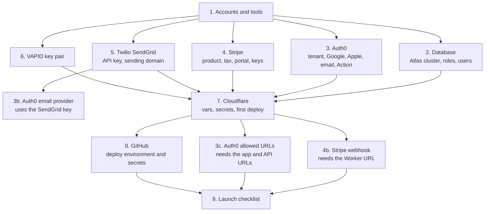

# Setting up Cairn from the ground up

These steps take a new environment (staging or production) from nothing to a running API. Do them in order. Each step says what it produces and which later step uses it.

To run Cairn on your own machine or in a Codespace instead, see [Local development](local-development.md). That needs no outside accounts.

## Order

| Step | Produces | Used by |
|---|---|---|
| [1. Accounts and tools](01-accounts-and-tools.md) | Accounts at every provider, local tools | Everything |
| [2. Database](02-database.md) | An Atlas cluster, three roles, three users, the schema, the templates | `MONGODB_URI`, `CAIRN_JOBS_MONGODB_URI`, `CAIRN_LOADER_MONGODB_URI`, `CAIRN_ADMIN_MONGODB_URI` |
| [3. Auth0](03-auth0.md) | A tenant with three sign-in methods, the post-login Action, a Management API client, Apple keys | `CAIRN_AUTH0_*`, `CAIRN_CLAIM_NAMESPACE`, `CAIRN_APPLE_*` |
| [4. Stripe](04-stripe.md) | The product, Stripe Tax, the customer portal, API keys, then the webhook | `CAIRN_STRIPE_*`, `CAIRN_SUBSCRIPTION_PRICE_CENTS` |
| [5. Twilio](05-twilio.md) | A SendGrid API key and an authenticated sending domain | `TWILIO_SENDGRID_API_KEY`, `CAIRN_EMAIL_FROM`, Auth0's email provider |
| [6. Browser notifications](06-browser-notifications.md) | A VAPID key pair | `CAIRN_VAPID_*` |
| [7. Cloudflare](07-cloudflare.md) | The Worker, both containers, the cron triggers, the public URL | Stripe webhook, Auth0 URLs, the client |
| [8. GitHub](08-github.md) | CI, the `cloudflare` deploy environment, branch protection | Every later deploy |
| [9. Launch checklist](09-launch-checklist.md) | Confirmation that it works, plus the open items before real users | |

## Before you start

- Decide the environment's name (for example `staging` or `production`). Use separate Auth0 tenants, Stripe accounts (or test mode versus live mode), Atlas projects, and Cloudflare Workers for each. Never share a database between environments.
- Decide the region the data must stay in. The Atlas cluster is created there.
- Have a password manager or secret manager ready. Every secret you create below goes straight into it and then into Cloudflare or GitHub. Never into a file in the repository, a chat, or a ticket. See [Secrets](../security/secrets.md).

The deploy steps here are also in the root [README](../../README.md#deploy-to-cloudflare). If the two disagree, the code wins. Fix whichever is wrong.
